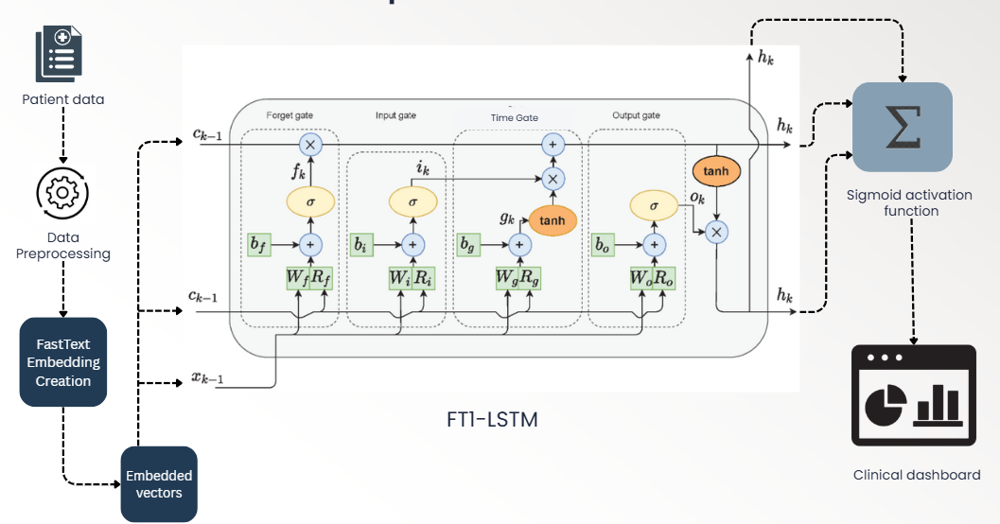

# 🏥 AI-Driven Risk Prediction with FT1-LSTM

This project is our hackathon prototype that predicts **patient deterioration risk within the next 90 days** using a **time-aware LSTM architecture (FT1-LSTM)**.  
We combine **vitals, labs, medications, and lifestyle data** with temporal information (irregular visit gaps) to give **clinicians explainable insights**.

---

## 🌐 Live Demo (Prototype)

👉 [**Try the Dashboard Here**](https://chronic-patient-risk-analyser-ltkgk7zyhb3v42ifwndvze.streamlit.app/)

---

## 🖼 Model Architecture

---

## 🔄 Workflow of the Model

1️⃣ **Input Data Collection**  
- Vitals: blood pressure, heart rate, glucose, BMI  
- Labs: HbA1c, cholesterol, creatinine  
- Medications: adherence %, refill gaps  
- Lifestyle: steps, sleep, diet  
- Timestamps: irregular time gaps between visits

2️⃣ **Preprocessing**  
- Handle missing values (imputation, forward-fill)  
- Normalize continuous features (z-score / min-max)  
- Create time-series windows (e.g., 120 days × features)  
- Compute Δt (time gaps) for time-aware learning  

3️⃣ **Representation Layer**  
- Event embeddings using **FastText**  
- Dense vectors capture semantic meaning of diagnoses & medications  

4️⃣ **FT1-LSTM (Core Model)**  
- Standard LSTM for sequential patterns  
- Extra **time gate (Tt)** to weight recent vs. old events  
- Mimics clinical intuition: "last week’s glucose spike > 3 months ago"

5️⃣ **Prediction Layer**  
- Dense + Sigmoid → Probability of deterioration (0–1)  

6️⃣ **Evaluation Metrics**  
- AUROC, AUPRC for discrimination  
- Calibration curves for probability reliability  
- Confusion matrix for sensitivity vs specificity  

7️⃣ **Explainability (SHAP)**  
- Global: top drivers (e.g., HbA1c trend > BP variability > missed meds)  
- Local: per-patient reasons for risk  

8️⃣ **Dashboard (Streamlit)**  
- **Cohort View**: Risk scores by patient/disease  
- **Patient Detail View**:  
  - Time-series plots of vitals/labs  
  - Top 3 risk drivers  
  - Recommended next actions  

---

## ⚙️ Tech Stack

- **Modeling**: PyTorch, FastText  
- **Explainability**: SHAP  
- **Dashboard**: Streamlit  
- **Data**: Synthetic EHR-like sequences for prototype  

---

## ✨ One-line Pitch

> *Our FT1-LSTM model takes 30–180 days of patient history, accounts for irregular time gaps, predicts the probability of deterioration within 90 days, and explains the key risk drivers in a simple clinician dashboard.*
